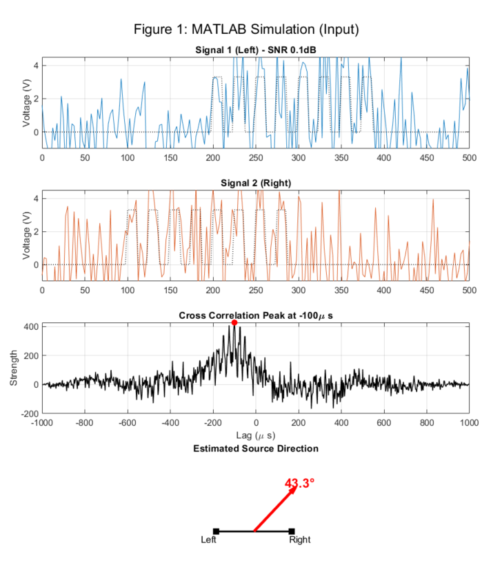
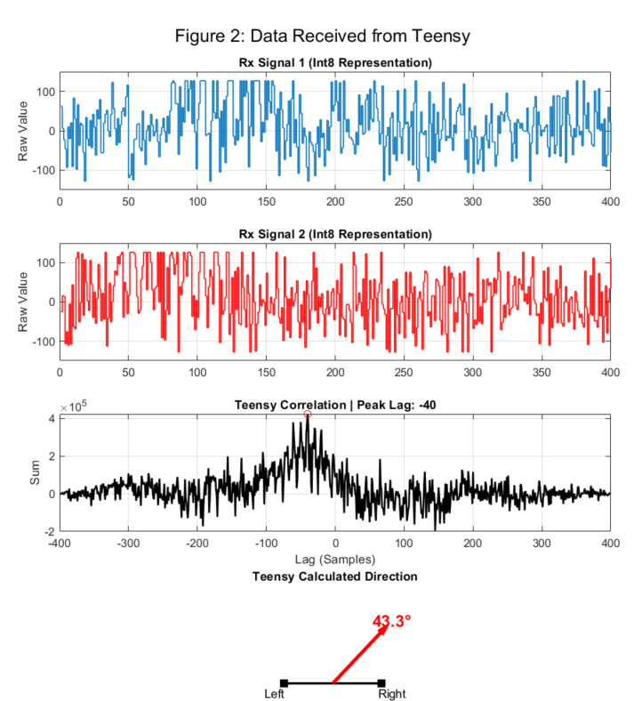

# Direction of Arrival (DOA) Estimation of Ultrasound with Teensy 4.1

This project implements a low-cost, real-time Direction of Arrival (DOA) estimation system using ultrasonic signals. By leveraging the high-performance Teensy 4.1 microcontroller and the Time Difference of Arrival (TDOA) technique, the system eliminates the need for bulky FPGAs or PC-based processing.

## Overview

Accurate acoustic tracking is critical for autonomous navigation and smart hearing aids. This system utilizes **40 kHz ultrasonic square wave bursts** to determine the source location of a sound.

### Key Features
* **High Performance:** Runs on Teensy 4.1 (600 MHz ARM Cortex-M7) with FPU support.
* **Robust Communication:** Uses Native USB High-Speed (480 Mbps) for data exchange.
* **Noise Resilience:** Accurate angle estimation even in low Signal-to-Noise Ratio (SNR) conditions (down to -10 dB).
* **Compact Design:** Optimized for embedded systems and potential wearable applications.

## System Architecture

The system operates in a closed loop between a host PC (MATLAB) and the embedded target (Teensy 4.1).

### The Workflow
1.  **Signal Generation (MATLAB):** The PC generates two 40 kHz square wave signals. A specific time delay ($\tau$) is injected into the second signal to simulate the physical sensor spacing ($d=5cm$).
2.  **Transmission:** Data is quantized to 8-bit integers and packetized with a 2-byte header (`0xFF, 0xFF`) before being sent via USB Serial.
3.  **Processing (Teensy 4.1):**
    * **Synchronization:** The MCU scans for the header to align data.
    * **Cross-Correlation:** It computes the discrete cross-correlation between the two channels:
      
      $$R_{xy}[m]=\sum_{n=0}^{N-1}x[n].y[n-m]$$

    * **Estimation:** The peak lag ($m_{peak}$) is found and converted to time delay ($\tau$).
4.  **Angle Calculation:** The Angle of Arrival ($\theta$) is derived using the far-field approximation:

      $$\theta = -\arcsin \left( \frac{v \cdot \tau}{d} \right)$$

5.  **Visualization:** Results are sent back to MATLAB for analysis.

## Simulation & Results

The system successfully tracks angles even when noise is introduced. Below are the results comparing the MATLAB input simulation against the real-time processing output from the Teensy.

 
*Figure 1: MATLAB Simulation Input showing signal generation and expected cross-correlation peak.*

 
*Figure 2: Real-time data received from Teensy showing recovered signals and calculated direction.*

## Hardware & Software

* **Microcontroller:** Teensy 4.1
* **IDE/Framework:** PlatformIO
* **Simulation/Host:** MATLAB
* **Library:** ARM CMSIS-DSP (`arm_math.h`)